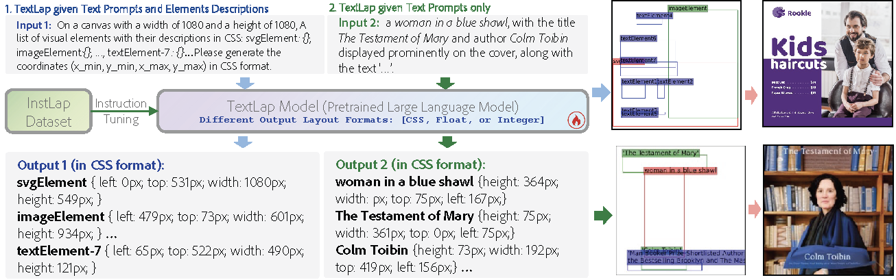
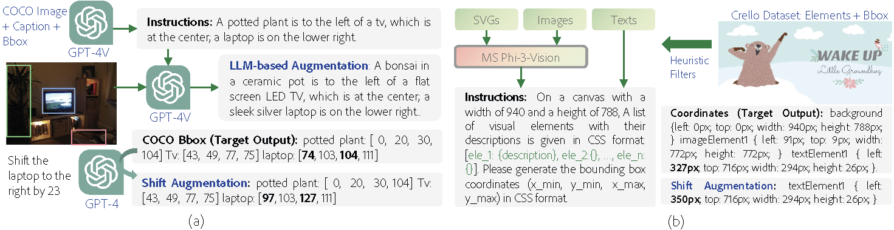

## TextLap
This repo is the source code of the paper: [TextLap: Customizing Language Models for Text-to-Layout Planning](https://arxiv.org/abs/2410.12844).<br />
<br />


## 1. Installation
```
conda create -n TextLap python=3.9
conda activate TextLap
pip install -r requirements.txt
pip install flash-attn --no-build-isolation
pip3 install -e ".[model_worker,webui]"
```

### 2. Training
TextLap is trained using [FastChat](https://github.com/lm-sys/FastChat). A slightly modified version of FastChat is also included in this repository, but its behavior should be the same as the official code when training without adding special tokens. A demo training script is also provided.
```
#!/bin/bash
output="/path/to/model/save/dir"
model_name="saved_model_name"
torchrun --nproc_per_node=8 --master_port=20003 fastchat/train/train.py \
    --model_name_or_path lmsys/vicuna-7b-v1.5  \
    --data_path /finetune/data/train_data.json \
    --bf16 True \
    --output_dir $output \
    --num_train_epochs 4 \
    --per_device_train_batch_size 4 \
    --per_device_eval_batch_size 4 \
    --gradient_accumulation_steps 1 \
    --evaluation_strategy "no" \
    --save_strategy "steps" \
    --save_steps 1000 \
    --save_total_limit 1 \
    --learning_rate 2e-5 \
    --weight_decay 0. \
    --warmup_ratio 0.03 \
    --lr_scheduler_type "cosine" \
    --logging_steps 2 \
    --fsdp "full_shard auto_wrap" \
    --fsdp_transformer_layer_cls_to_wrap 'LlamaDecoderLayer' \
    --tf32 True \
    --model_max_length 2048 \
    --gradient_checkpointing True \
    --lazy_preprocess True \
    --special_token False
```

### 3. Inference
#### 3.1 graphic design model
The graphic design model on the `Crello` dataset requires a multimodal language model to generate captions for each visual element. The code to run the inference script is as follows:
```
python inference_crello.py
```
The code will show a comparison between the real layout and generated layout.


#### 3.2 image layout planning model
The image layout planning model is trained on the COCO layout dataset. The checkpoint trained using CSS layout format is released and tested:
```
python inference_coco.py
```


### 4. Command line Chat
For chat through command line
```
python3 -m fastchat.serve.cli --model-path "/dir/to/checkpoint" --query_dir "path/to/test_data.json"
```


## InstLap Dataset
The fine-tuning data is available as JSON files in the [finetune_data](https://github.com/puar-playground/TextLap/tree/main/finetune_data) folder.

The graphic design subset of the InstLap dataset has been released separately on Huggingface at [puar-playground/crello-cap](https://huggingface.co/datasets/puar-playground/crello-cap) to support future research. The crello-cap dataset includes both the training and testing splits from Crello, with element captions generated by Phi-3-Vision. Smaller elements are filtered and merged into the background, labeled as `background_merge`.
<br /><br />



## Reference
```
@article{chen2024textlap,
  title={TextLap: Customizing Language Models for Text-to-Layout Planning},
  author={Chen, Jian and Zhang, Ruiyi and Zhou, Yufan and Healey, Jennifer and Gu, Jiuxiang and Xu, Zhiqiang and Chen, Changyou},
  journal={arXiv preprint arXiv:2410.12844},
  year={2024}
}
```

